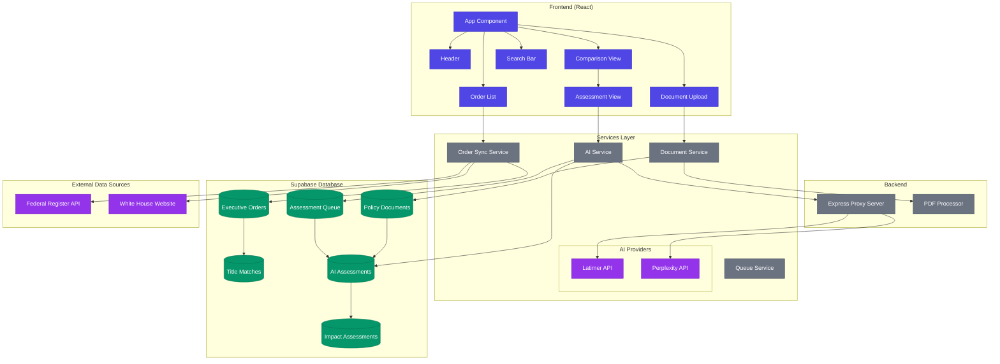

```mermaid
graph TB
    subgraph Frontend ["Frontend (React)"]
        App[App Component]
        Header[Header]
        OrderList[Order List]
        ComparisonView[Comparison View]
        AssessmentView[Assessment View]
        SearchBar[Search Bar]
        DocumentUpload[Document Upload]
    end

    subgraph Services ["Services Layer"]
        direction TB
        AIService[AI Service]
        DocumentService[Document Service]
        OrderSync[Order Sync Service]
        QueueService[Queue Service]
        
        subgraph AIProviders ["AI Providers"]
            Latimer[Latimer API]
            Perplexity[Perplexity API]
        end
    end

    subgraph Backend ["Backend"]
        ProxyServer[Express Proxy Server]
        PDFProcessor[PDF Processor]
    end

    subgraph Database ["Supabase Database"]
        direction TB
        ExecutiveOrders[(Executive Orders)]
        PolicyDocuments[(Policy Documents)]
        TitleMatches[(Title Matches)]
        AIAssessments[(AI Assessments)]
        ImpactAssessments[(Impact Assessments)]
        AssessmentQueue[(Assessment Queue)]
    end

    subgraph ExternalAPIs ["External Data Sources"]
        FederalRegister[Federal Register API]
        WhiteHouse[White House Website]
    end

    %% Frontend Component Relations
    App --> Header
    App --> OrderList
    App --> ComparisonView
    App --> SearchBar
    App --> DocumentUpload
    ComparisonView --> AssessmentView

    %% Service Connections
    OrderList --> OrderSync
    DocumentUpload --> DocumentService
    AssessmentView --> AIService
    AIService --> ProxyServer
    ProxyServer --> Latimer
    ProxyServer --> Perplexity
    DocumentService --> PDFProcessor
    
    %% Data Flow
    OrderSync --> FederalRegister
    OrderSync --> WhiteHouse
    OrderSync --> ExecutiveOrders
    DocumentService --> PolicyDocuments
    AIService --> AIAssessments
    AIService --> AssessmentQueue
    
    %% Database Relations
    ExecutiveOrders --> TitleMatches
    PolicyDocuments --> AIAssessments
    AIAssessments --> ImpactAssessments
    AssessmentQueue --> AIAssessments

    classDef primary fill:#4f46e5,stroke:#4338ca,color:#fff
    classDef secondary fill:#6b7280,stroke:#4b5563,color:#fff
    classDef database fill:#059669,stroke:#047857,color:#fff
    classDef external fill:#9333ea,stroke:#7e22ce,color:#fff
    
    class App,Header,OrderList,ComparisonView,AssessmentView,SearchBar,DocumentUpload primary
    class AIService,DocumentService,OrderSync,QueueService,ProxyServer,PDFProcessor secondary
    class ExecutiveOrders,PolicyDocuments,TitleMatches,AIAssessments,ImpactAssessments,AssessmentQueue database
    class FederalRegister,WhiteHouse,Latimer,Perplexity external
```